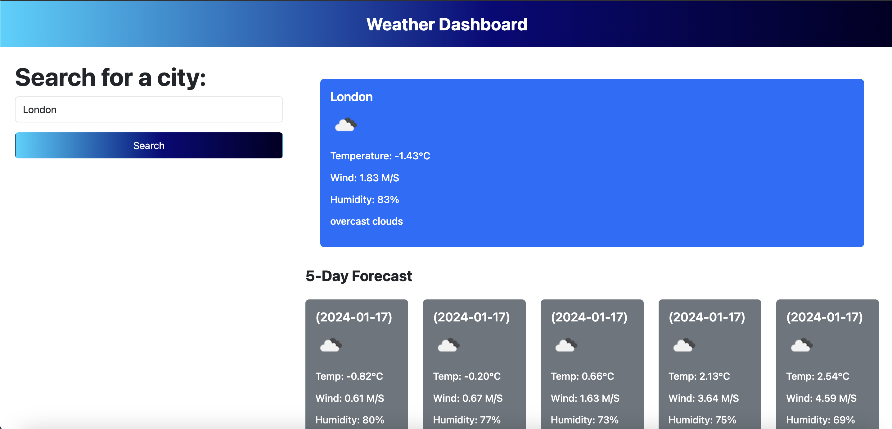

## Weather Forecast App

This is a simple web application that allows users to get weather forecasts for cities around the world. It leverages the OpenWeatherMap API to fetch and display weather information.

# Features
Current Weather: View the current weather conditions for the selected city, including temperature, wind speed, and humidity.

5-Day Forecast: Get a 5-day weather forecast with details for each day, such as temperature, wind speed, and humidity.

# How to Use
Enter the name of a city in the input field.

Click the "Search" button to fetch weather data for the specified city.

The current weather and 5-day forecast will be displayed below the input.

Deployed URL -

